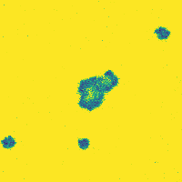
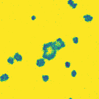

# Stochastic Modelling for Systems Biology

This repository contains the supplementary computational codebase for my mathematics dissertation, *Investigation of Stochastic Simulation
Methods in Spatially Extended Reaction-Diffusion Systems*. It implements exact discrete stochastic simulations alongside continuous approximations to investigate the role of intrinsic demographic noise in biological systems, spanning from simple temporal dynamics to complex spatiotemporal reaction-diffusion waves.

## 📌 Project Overview

Traditional macroscopic models often rely on deterministic partial differential equations (PDEs), which operate on continuous concentrations and implicitly assume an infinite system size ($\Omega \to \infty$). This project analyses the breakdown of these assumptions in low-copy-number environments by comparing three mathematical frameworks:
1. **The Gillespie Algorithm (SSA):** Exact, discrete stochastic realisations.
2. **The Chemical Langevin Equation (CLE):** A continuous stochastic differential equation (SDE) approximation.
3. **Deterministic ODEs/PDEs:** The macroscopic limits, solved via custom Runge-Kutta (RK4) and Euler methods.

---

## 🔬 Visualising the Breakdown of Turing Patterns (Gray-Scott Model)

The spatial Gray-Scott model highlights a critical finding of this project: deterministic equations are scale-invariant and fail to capture the disruptive nature of demographic noise in intracellular environments. 

Below is the temporal evolution of the system. Notice how the High $\Omega$ systems form coherent, macroscopic Turing patterns, while the Low $\Omega$ systems struggle to maintain spatial boundaries due to discrete molecular fluctuations.

### 1. Labyrinth Formation
<p align="center">
  
  
</p>
<p align="center">
  <em>Left: High capacity ($\Omega=1000$) approximating the PDE limit. Right: Low capacity ($\Omega=50$) dominated by demographic noise.</em>
</p>

### 2. Spot Replication
<p align="center">
  
  
</p>
<p align="center">
  <em>Left: Coherent spatial replication. Right: Stochastic disruption of the wave fronts.</em>
</p>

---

## 📂 Repository Structure

The codebase is highly modular, separating custom mathematical engines, long-running computational scripts, and data visualisation notebooks to ensure absolute reproducibility.

* **`notebooks/`**: Jupyter Notebooks containing the core analysis and figure generation.
  * `Fig2_1_to_2_6_Theoretical_Foundations.ipynb`
  * `Fig4_1_Benchmarking.ipynb`
  * `Fig4_2_to_4_5_Lotka_Volterra.ipynb`
  * `Fig4_6_to_4_7_SIR.ipynb`
  * `Fig4_8_to_4_9_Gray_Scott.ipynb`
* **`scripts/`**: Standalone Python scripts for executing computationally intensive tasks. 
  * `run_benchmarks.py` (Executes the $100 \times 100$ exact spatial SSA timings).
* **`src/`**: Custom mathematical engines.
  * `solvers.py` (Contains a custom RK4 solver to prevent numerical drift in cyclic phase orbits).
* **`data/`**: Serialised `.pkl` arrays and `.csv` files storing pre-computed spatial trajectories, preventing out-of-memory errors and allowing instant notebook rendering.
* **`Poster_Gifs/`**: Compiled `.gif` animations of the spatial models linked to the physical dissertation poster.

---

## ⚙️ Reproducibility & Installation Guide

Scientific Python environments relying on JAX for high-performance array computing can be complex to configure. To ensure full reproducibility across different hardware, please follow the steps below to create an isolated `conda` environment.

### 1. Prerequisites
Ensure you have [Anaconda or Miniconda](https://docs.conda.io/en/latest/miniconda.html) installed on your system.

### 2. Environment Setup
Open your terminal and run the following commands to create and activate a fresh environment:

```bash
# Create a new environment using a stable Python version
conda create -n smfsb_project python=3.10 -y

# Activate the environment
conda activate smfsb_project

# Install Jupyter to run the notebooks natively
conda install -c conda-forge jupyterlab -y
